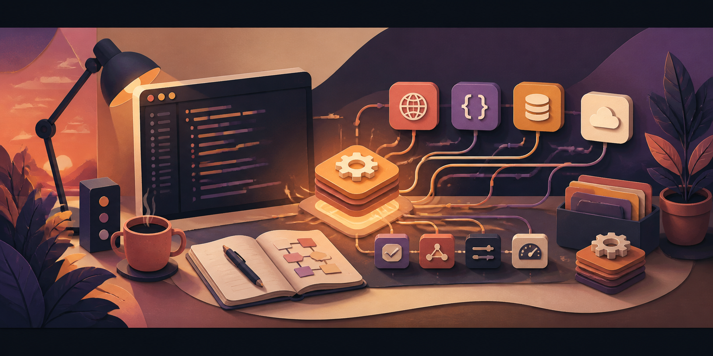

  

<h1 align="center">Hey, I'm Ali 👋</h1>

  <strong>I turn real problems into software that's useful, dependable, and pleasant to work with.</strong>

  Problem solving · System design · Product thinking · Thoughtful delivery

## A little about me

I'm a software developer who enjoys taking an idea from a rough problem to a working product. I like understanding what people actually need, breaking complex work into clear parts, and designing systems that can grow without becoming difficult to maintain.

Most of my projects begin with a practical question: **Can this workflow be simpler?** I care about the full journey—from shaping requirements and making technical tradeoffs to documentation and the small details that make software comfortable to use.

Languages and frameworks are tools I choose to fit the job. The goal stays the same: solve the right problem, build it thoughtfully, and leave behind software that remains easy to understand.

> Good software should feel obvious to use and calm to maintain.

## Tools I reach for

  
  
  
  
  
  
  
  

## Let's make something useful

If you're building something thoughtful—or have an awkward workflow worth automating—I'd be glad to hear about it.

